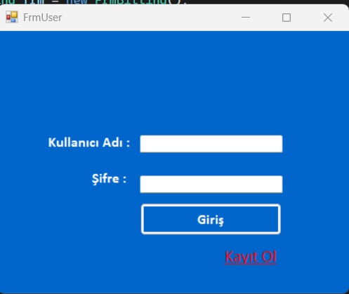
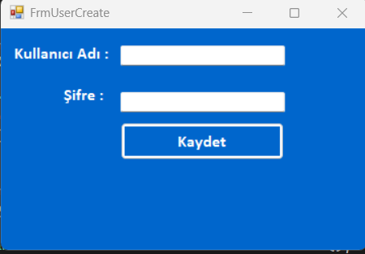
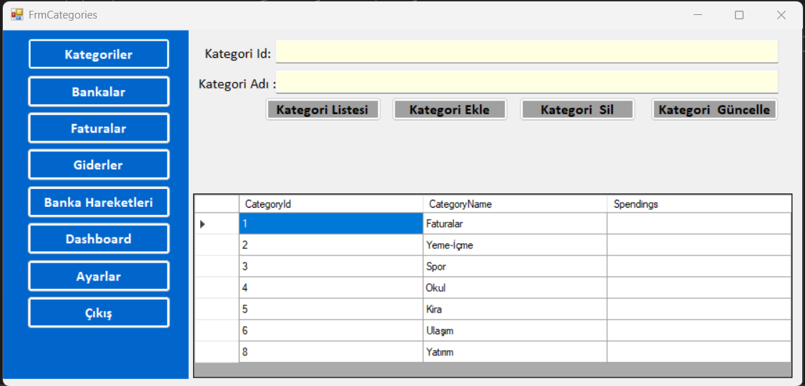
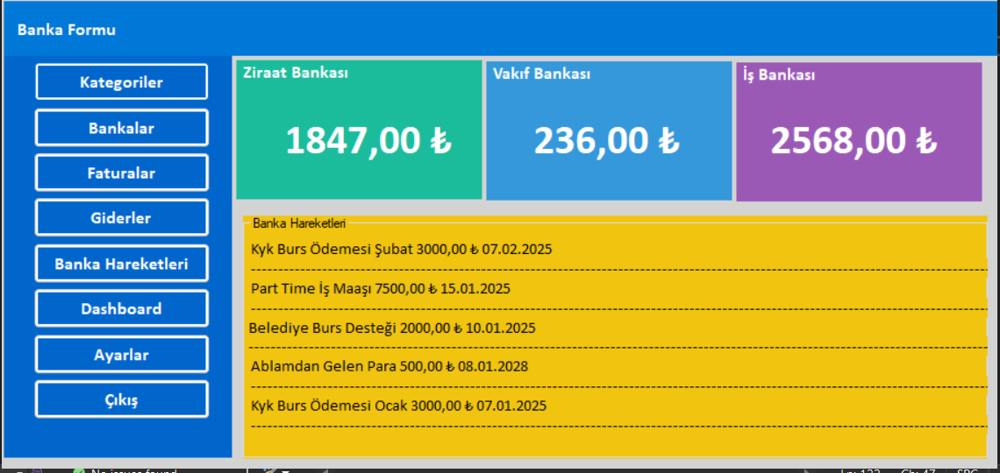
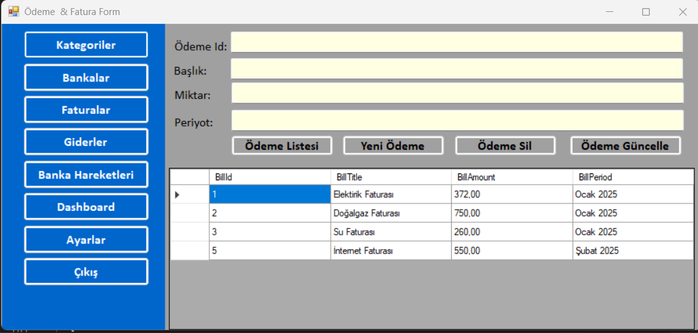
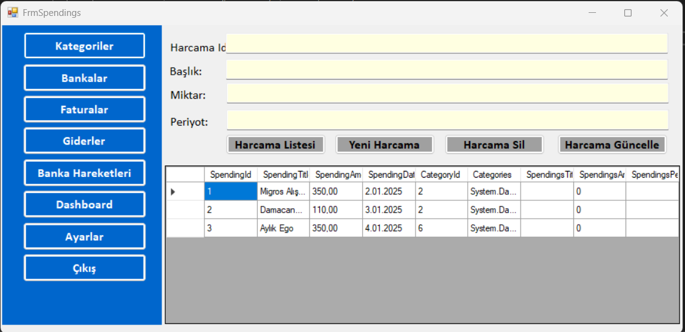
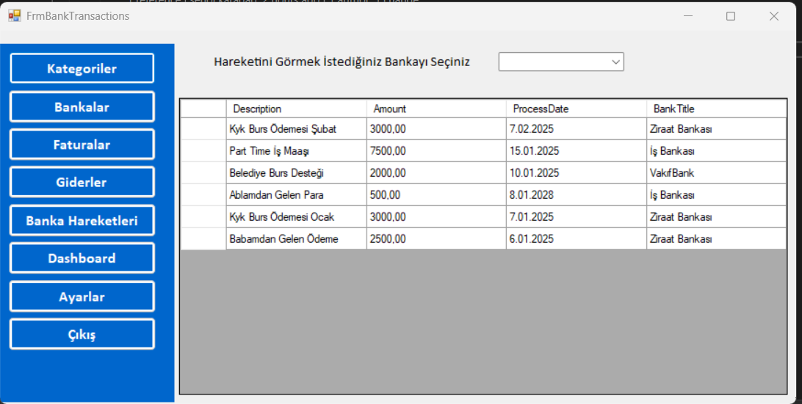
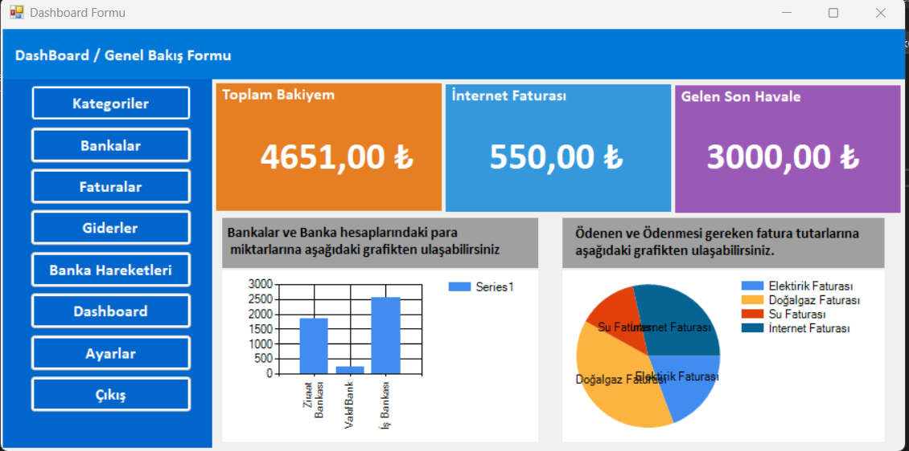
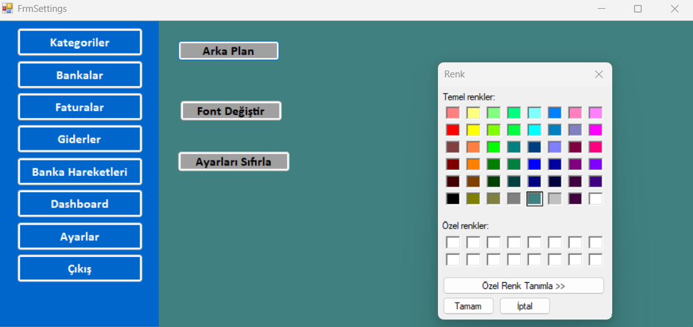

# 💼 FinancialCRM

> **FinansalCRM**, [Murat Yücedağ](https://www.youtube.com/@murat_yucedag)'ın C# Eğitim Kampı kapsamında geliştirilen bir masaüstü finans yönetim uygulamasıdır.

## 🚀 Proje Hakkında

Bu uygulama, bireysel veya küçük ölçekli kullanıcıların finansal işlemlerini yönetebileceği, kullanıcı dostu bir masaüstü uygulamasıdır.  
C#, .NET Framework ve Entity Framework kullanılarak Windows Forms arayüzüyle geliştirilmiştir.

## 🛠 Kullanılan Teknolojiler

- 🧠 **C#**
- 🖼 **Windows Forms**
- 🗃 **Microsoft SQL Server**
- 🌐 **Entity Framework**
- 📌 **LINQ Sorguları**
- 🛠 **.NET Framework**

## ⚙️ Uygulama Özellikleri

| Özellik | Açıklama |
|--------|----------|
| 🔐 **Kullanıcı Güvenli Girişi** | Entity Framework üzerinden kullanıcı yönetimi ve oturum kontrolü |
| 💸 **Harcama Kontrolü** | Gider ekleme, güncelleme ve silme işlemleri |
| 🏦 **Banka İşlem Kayıtları** | Banka giriş/çıkış hareketleri ve kayıt defteri yönetimi |
| 📊 **Finansal Raporlama** | Harcamalar ve banka hareketlerine dair genel raporlar |
| 🗄 **Kalıcı Veri Yönetimi** | SQL Server ile güvenli ve kalıcı veri saklama |
| 🖥️ **Kullanıcı Dostu Arayüz** | Basit ve anlaşılır Windows Forms arayüzü |

## 🔧 Kurulum

> Projeyi Visual Studio üzerinden açarak kolayca çalıştırabilirsiniz. SQL Server bağlantısını kontrol etmeyi unutmayın.

```bash
git clone https://github.com/Mrfelislynx/FinancialCrm.git


## 📸 Uygulama Ekran Görüntüleri

### 🔐 1. Kullanıcı Giriş Ekranı


### 📝 2. Yeni Kullanıcı Kayıt Ekranı


### 🗂️ 3. Kategori Yönetimi


### 🏦 4. Banka Bilgileri


### 📄 5. Fatura Kayıtları


### 💸 6. Harcamalar / Giderler


### 🔁 7. Banka Hareketleri


### 📊 8. Dashboard - Genel Bakış


### ⚙️ 9. Ayarlar Ekranı



